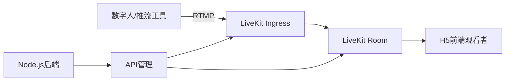

# LiveKit 数字人推流完整测试指南

## 🎯 项目概述

本项目实现了从上游数字人服务器到H5前端的完整视频流传输链路：

```
上游数字人/RTMP推流 → LiveKit Ingress → LiveKit Room → H5前端观看
```

## 🏗️ 架构说明

### 核心组件

1. **LiveKit Ingress**: 接收RTMP推流的入口点
2. **LiveKit Room**: 视频流的中转和分发中心  
3. **Node.js后端**: 提供API管理和静态文件服务
4. **H5前端**: 基于LiveKit Client SDK的观看端

### 数据流向



## 🚀 快速开始

### 1. 环境准备

```bash
# 安装依赖
npm install

# 安装FFmpeg (用于推流测试)
# macOS
brew install ffmpeg

# Ubuntu
sudo apt install ffmpeg

# 安装Python依赖 (用于推流脚本)
pip install requests
```

### 2. 启动服务

```bash
# 启动后端服务
npm start

# 服务将运行在 http://localhost:3000
```

### 3. 配置LiveKit

确保 `.env` 文件包含正确的LiveKit配置：

```env
LIVEKIT_URL=wss://your-livekit-server.com
LIVEKIT_API_KEY=your-api-key
LIVEKIT_API_SECRET=your-api-secret
PORT=3000
```

## 🧪 测试方案

### 方案一：完整流程测试页面 (推荐)

1. 打开 `http://localhost:3000/test-complete-flow.html`
2. 按照页面指引完成测试：
   - 创建推流接入点
   - 开始推流 (Python脚本或手动)
   - 连接观看端
   - 验证视频播放

### 方案二：分步测试

#### 步骤1: 创建Ingress

```bash
# 使用API创建推流接入点
curl -X POST http://localhost:3000/api/livekit/ingress \
  -H "Content-Type: application/json" \
  -d '{"roomName": "test-room", "participantName": "digital-human"}'
```

#### 步骤2: 开始推流

**选项A: 使用Python脚本 (自动化)**
```bash
python3 mock-rtmp-stream.py
```

**选项B: 使用FFmpeg (手动)**
```bash
# 替换 RTMP_URL 为API返回的推流地址
ffmpeg -re -i test_video.mp4 -c:v libx264 -c:a aac -f flv RTMP_URL
```

**选项C: 使用OBS Studio**
- 服务: 自定义
- 服务器: `rtmp://your-ingress-url/live`
- 推流码: `your-stream-key`

#### 步骤3: 前端观看

1. 打开 `http://localhost:3000`
2. 输入房间名 `test-room`
3. 点击"加入房间"
4. 观看推流视频

## 📋 测试页面说明

### 1. 主页面 (`/`)
- 基础的LiveKit房间连接和观看功能
- 适合简单的观看测试

### 2. Ingress管理页面 (`/test-ingress.html`)
- 专门用于管理LiveKit Ingress
- 创建、查看、监控推流接入点
- 适合推流端测试

### 3. 完整流程测试页面 (`/test-complete-flow.html`)
- 集成推流管理和观看功能
- 一站式完整流程测试
- **推荐用于完整测试**

## 🔧 API接口

### 创建Ingress
```http
POST /api/livekit/ingress
Content-Type: application/json

{
  "roomName": "test-room",
  "participantName": "digital-human"
}
```

### 获取房间信息
```http
GET /api/livekit/room/{roomName}
```

### 列出所有Ingress
```http
GET /api/livekit/ingress
```

### 获取访问令牌
```http
POST /api/livekit/join
Content-Type: application/json

{
  "roomName": "test-room",
  "participantName": "viewer-1"
}
```

## 🐛 故障排除

### 常见问题

1. **推流连接失败**
   - 检查LiveKit服务器配置
   - 确认Ingress创建成功
   - 验证RTMP URL格式

2. **前端无法连接**
   - 检查房间名是否正确
   - 确认LiveKit URL和密钥配置
   - 查看浏览器控制台错误

3. **视频无法播放**
   - 确认推流端正在推流
   - 检查视频编码格式 (建议H.264)
   - 验证网络连接

### 调试工具

1. **查看服务器日志**
   ```bash
   # 服务器控制台会显示连接和错误信息
   ```

2. **检查房间状态**
   ```bash
   curl http://localhost:3000/api/livekit/room/test-room
   ```

3. **浏览器开发者工具**
   - 查看Network标签页的API请求
   - 查看Console标签页的JavaScript错误

## 📈 性能优化

### 推流端优化
- 使用合适的视频编码参数
- 控制码率和分辨率
- 启用硬件编码 (如可用)

### 观看端优化
- 启用自适应码率
- 优化网络缓冲
- 使用WebRTC优化

## 🔒 安全考虑

1. **API密钥管理**
   - 不要在前端暴露API密钥
   - 使用环境变量存储敏感信息

2. **访问控制**
   - 实现房间访问权限控制
   - 添加用户身份验证

3. **网络安全**
   - 使用HTTPS/WSS协议
   - 配置适当的CORS策略

## 📚 扩展功能

### 可能的扩展方向

1. **多路推流支持**
   - 支持多个数字人同时推流
   - 实现推流负载均衡

2. **录制功能**
   - 添加推流录制
   - 实现回放功能

3. **实时互动**
   - 添加文字聊天
   - 实现语音交互

4. **监控和分析**
   - 推流质量监控
   - 观看数据统计

## 🤝 贡献指南

1. Fork项目
2. 创建功能分支
3. 提交更改
4. 创建Pull Request

## 📄 许可证

MIT License - 详见LICENSE文件